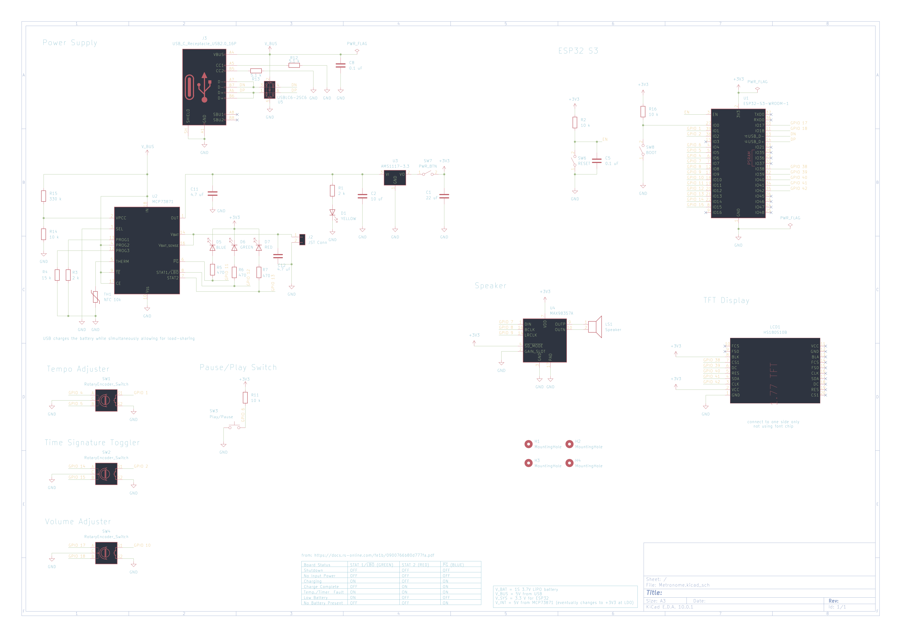
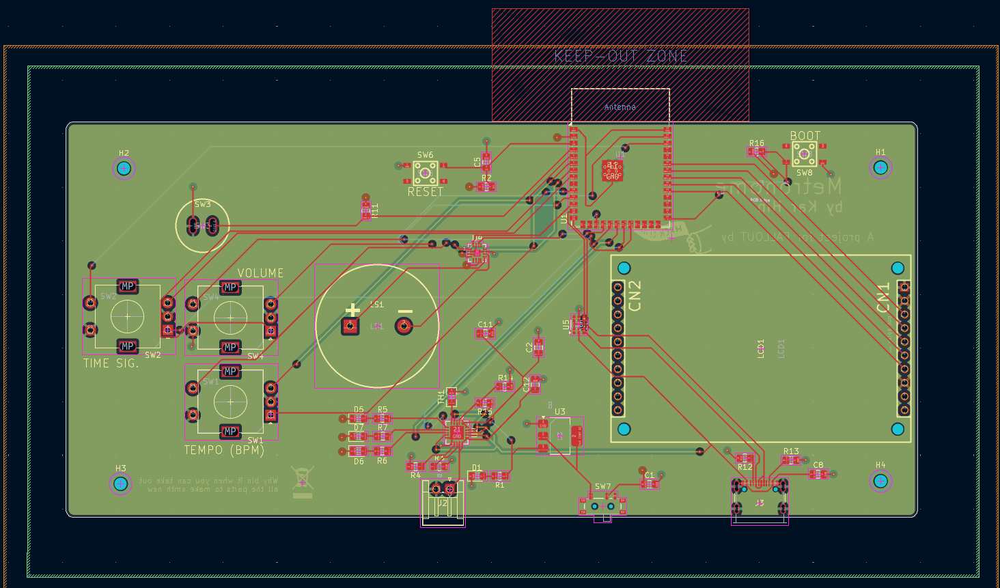
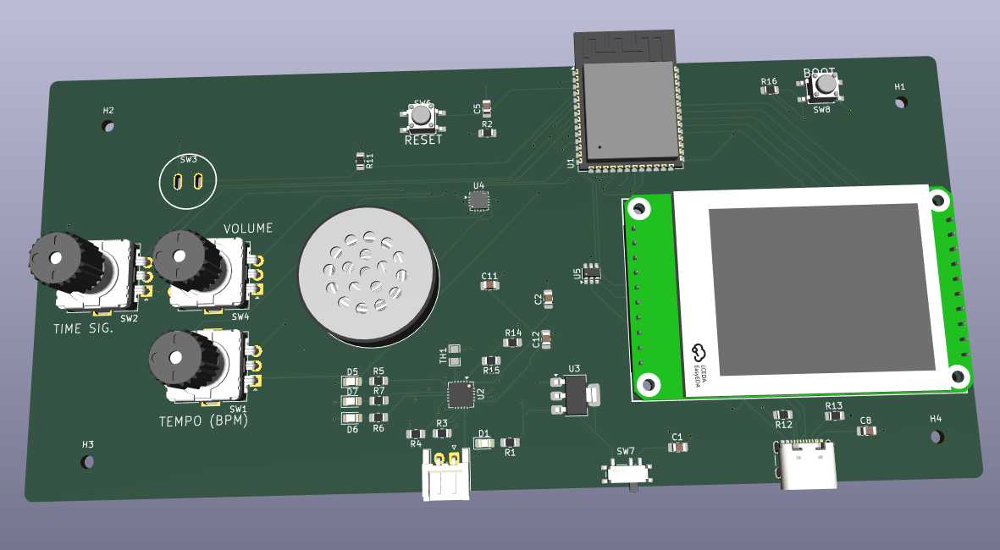
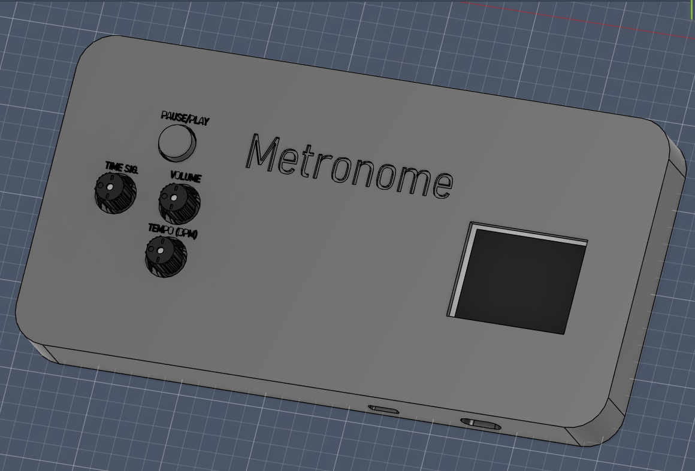
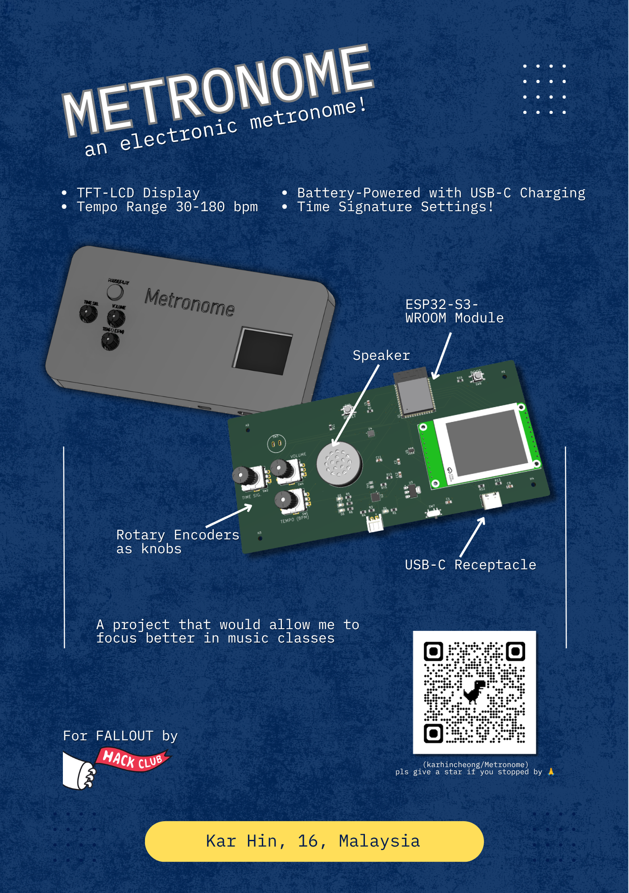

# Metronome

An electronic metronome powered by an ESP32-S3-WROOM Module, utilising a 160 x 128 LCD-TFT screen and a speaker

## Motivation

I find my phone too distracting when attending music class, hence I'm making this metronome on a separate device so that its simple and non-distracting

## BOM

### Components

| Item             | Description      | Quantity | Unit Price (USD) | Total Price (USD) | URL                                                | MOQ |
| ---------------- | ---------------- | -------- | ---------------- | ----------------- | -------------------------------------------------- | --- |
| Capacitors       | 0805 22 uF       | 1        | 0.0696           | 0.7               | https://www.lcsc.com/product-detail/C5674.html     | 10  |
|                  | 0805 4.7 uF      | 2        | 0.0267           | 0.53              | https://www.lcsc.com/product-detail/C1779.html     | 20  |
|                  | 0805 10 uF       | 1        | 0.0421           | 0.84              | https://www.lcsc.com/product-detail/C17024.html    | 20  |
|                  | 0805 0.1 uF      | 2        | 0.0061           | 0.15              | https://www.lcsc.com/product-detail/C476766.html   | 25  |
| LEDs             | 0805 YELLOW      | 1        | 0.0118           | 0.59              | https://www.lcsc.com/product-detail/C20608785.html | 50  |
|                  | 0805 BLUE        | 1        | 0.0078           | 0.78              | https://www.lcsc.com/product-detail/C19171391.html | 100 |
|                  | 0805 GREEN       | 1        | 0.0222           | 0.67              | https://www.lcsc.com/product-detail/C84260.html    | 30  |
|                  | 0805 RED         | 1        | 0.007            | 0.7               | https://www.lcsc.com/product-detail/C965812.html   | 100 |
| JST Connector    |                  | 1        | 0.0393           | 0.79              | https://www.lcsc.com/product-detail/C173752.html   | 20  |
| USB-C Receptacle |                  | 1        | 0.0877           | 0.44              | https://www.lcsc.com/product-detail/C2988369.html  | 5   |
| TFT-LCD          | ST7735 160\*128  | 1        | 3.2069           | 3.21              | https://www.lcsc.com/product-detail/C5329585.html  | 1   |
| Speaker          |                  | 1        | 0.818            | 0.82              | https://www.lcsc.com/product-detail/C530531.html   | 1   |
| Resistors        | 0805 2k          | 2        | 0.0031           | 0.31              | https://www.lcsc.com/product-detail/C2907248.html  | 100 |
|                  | 0805 10k         | 4        | 0.0031           | 0.31              | https://www.lcsc.com/product-detail/C2930231.html  | 100 |
|                  | 0805 5.1k        | 2        | 0.0028           | 0.28              | https://www.lcsc.com/product-detail/C27834.html    | 100 |
|                  | 0805 330k        | 1        | 0.004            | 0.4               | https://www.lcsc.com/product-detail/C114528.html   | 100 |
|                  | 0805 15k         | 1        | 0.0033           | 0.33              | https://www.lcsc.com/product-detail/C2930170.html  | 100 |
|                  | 0805 470Ω        | 3        | 0.003            | 0.3               | https://www.lcsc.com/product-detail/C2907267.html  | 100 |
| Rotary Encoders  | EC11             | 3        | 1.9069           | 5.72              | https://www.lcsc.com/product-detail/C470742.html   | 1   |
| Slide Switch     | SPST             | 1        | 0.0541           | 0.54              | https://www.lcsc.com/product-detail/C7498220.html  | 10  |
| Push Buttons     | 4.5 x 4.5 mm     | 2        | 0.0109           | 0.55              | https://www.lcsc.com/product-detail/C52092029.html | 50  |
|                  | ⌀ 10 mm          | 1        | 0.3832           | 0.38              | https://www.lcsc.com/product-detail/C268254.html   | 1   |
| Thermistor       | NTC 10k          | 1        | 0.685            | 0.69              | https://www.lcsc.com/product-detail/C17376775.html | 1   |
| ESP32-S3-WROOM-1 |                  | 1        | 4.5417           | 4.54              | https://www.lcsc.com/product-detail/C2913197.html  | 1   |
| MCP73871         |                  | 1        | 4.5329           | 4.53              | https://www.lcsc.com/product-detail/C5121473.html  | 1   |
| AMS1117          | 3.3V Variant     | 1        | 0.0424           | 0.04              | https://www.lcsc.com/product-detail/C347222.html   | 1   |
| MAX98357A        |                  | 1        | 1.3362           | 1.34              | https://www.lcsc.com/product-detail/C910544.html   | 1   |
| USBLC6-2SC6      |                  | 1        | 0.164            | 0.82              | https://www.lcsc.com/product-detail/C7519.html     | 5   |
| Battery          | 3.7V LiPO 300mAh | 1        | 0.79             | 0.79              | https://item.szlcsc.com/mro/419942.html            | 1   |
|                  |                  |          |                  |                   |                                                    |     |
| TOTAL            |                  |          |                  | 32.09             |                                                    |     |

### Other Costs Incurred

| Item         | Description       | Price |
| ------------ | ----------------- | ----- |
| PCB Printing | JLCPCB            | 2.00  |
| Shipping     | UPS Express Saver | 9.24  |

## Assembly Instructions

| Folder        | Description                       |
| ------------- | --------------------------------- |
| `kicad/`      | KiCAD files                       |
| `3d/`         | 3D files for the case and the PCB |
| `src/`        | Source Code for firmware          |
| `production/` | Files for manufacturers           |

1. Solder the components by hand onto the PCB. You may opt for PCBA for some of the components but it's expensive.
2. 3D Print the case of the the PCB.
3. Install the PCB into the case by screwing the PCB down using 4 M2 screws onto the 4 holes.

## Schematic Diagram

For clearer version, please refer `schematics.pdf`, or maybe you're trying to attract bugs ...

## PCB Layout

## PCB Render

You may refer to `3d/pcb3d.step` but note that there will not be any silkscreen or solder mask on it

## Case

Refer to `3d/metronomecase.step` or `3d/metronomecase.f3d` if you use Autodesk Fusion

## Project Zine

Uncompressed version at `zine.pdf`
